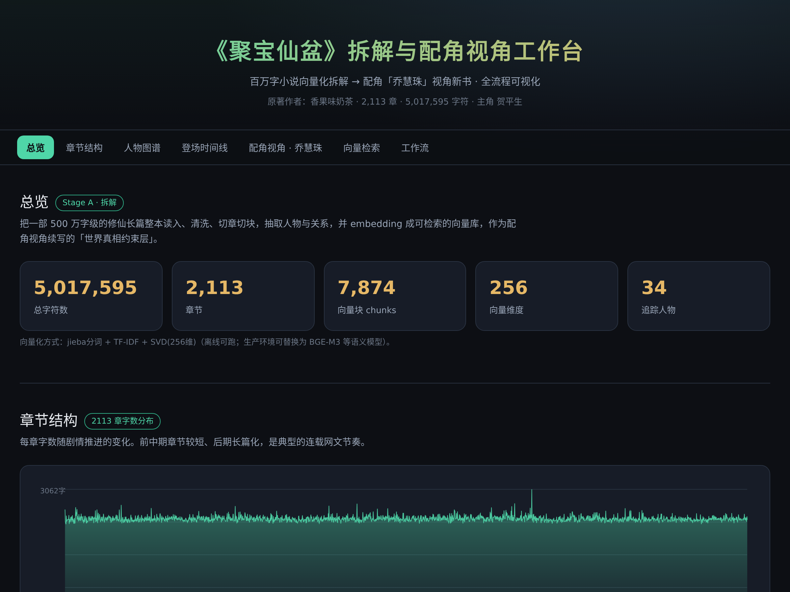

<div align="center">

# NovelRAG · 小说 RAG 引擎

**把一部百万字长篇小说拆解成向量库，再从一个「配角」的视角，续写一部与原著严丝合缝的平行长篇。**

*Deconstruct a million-word novel into a vector store, then rewrite it as a parallel novel from a supporting character's point of view.*

[English](#english) · [中文](#中文) · [快速开始](#快速开始) · [设计文档](docs/DESIGN_zh.md)



</div>

---

## 中文

### 这是什么

`NovelRAG` 是一套「小说拆解 + 配角视角续写」的开源工作流，分两个阶段：

- **阶段 A · 拆解与向量化**：把整本小说清洗、切章切块，抽取人物 / 关系 / 时间线，并 embedding 成可检索的向量库，作为续写时的「**世界真相约束层**」。
- **阶段 B · 配角视角生成**：选定一个配角，产出他的「**人物圣经**」和「**信息边界表**」，再逐章生成——每章都用向量库回查原著保证不矛盾，同时用信息边界过滤掉配角此刻不该知道的内容。

配角视角小说的灵魂是 **信息差**：读者跟着配角，看到被主角视角遮蔽的另一面。原著早已揭示的真相，配角可能很晚才拼凑出来，甚至一辈子蒙在鼓里。

### Showcase：《聚宝仙盆》→ 乔慧珠视角

本仓库以一部真实的修仙长篇《聚宝仙盆》(约 **2113 章 / 500 万字**，主角贺平生靠【聚宝盆】开挂) 作为示例，配角选定女主级角色 **乔慧珠**。

| 指标 | 数值 |
|---|---|
| 章节 | 2,113 |
| 字符 | 5,017,595 |
| 向量块 chunks | 7,874 |
| 向量维度 | 256 |
| 追踪人物 | 34 |
| 配角视角 | 乔慧珠（出场 2,403 次，贯穿全书） |

> **核心信息差**：乔慧珠永远不知道【聚宝盆】的存在——她只能把贺平生的火箭式崛起归于「天赋与机缘」。而她独有一段主角不知情的私密往事。这一正一反两条信息差，就是她视角新书的全部张力来源。

<table>
<tr>
<td width="50%"><br><sub>人物图谱 + 同章共现网络</sub></td>
<td width="50%"><br><sub>配角人物圣经</sub></td>
</tr>
</table>

### 架构

```
源小说(txt)
   │
   ├─[阶段A 拆解]─► 清洗 ─► 切章切块 ─► 人物/关系/时间线抽取 ─► 向量库(世界真相层)
   │                                              │
   │                                              └─► 配角人物圣经 + 信息边界表
   │
   └─[阶段B 生成]─► 配角视角大纲 ─► 逐章生成(双路召回) ─► 一致性质检 ─► 配角视角新书
                                        ▲            ▲
                                   配角圣经      源小说向量库
```

### 快速开始

**可视化工作台（Next.js）**

```bash
cd web
npm install
npm run dev        # http://localhost:3000
```
7 个板块：总览 / 章节结构 / 人物图谱 / 登场时间线 / 配角视角 / 向量检索 / 工作流。图表全部手写 SVG，零第三方图表库。

**拆解流水线（Python）**

```bash
cd pipeline
pip install -r requirements.txt
# 把你的源小说放到 ./source/raw.txt（UTF-8），然后：
python 01_clean_split.py    # 清洗 + 切章
python 02_chunk.py          # 两级切块（带重叠）
python 04_char_stats.py     # 人物词频 / 共现网络 / 时间线
python 05_embed.py          # 向量化（离线 TF-IDF + SVD-256）
python 06_search.py         # 交互式向量检索
python 07_export.py         # 导出可视化数据
```

> 向量化默认用离线的 `jieba + TF-IDF + SVD(256维)`，零外网依赖即可跑通。生产环境把 `05_embed.py` 换成 **BGE-M3** 等语义 embedding 模型即可获得更强的语义检索。

### 目录

| 目录 | 内容 |
|---|---|
| `web/` | Next.js 14 可视化工作台（App Router，手写 SVG 图表） |
| `pipeline/` | 拆解脚本 01–07（清洗 → 切块 → 抽取 → 向量化 → 检索 → 导出） |
| `showcase/` | 《聚宝仙盆》衍生分析产物 + 乔慧珠人物圣经 / 信息边界 / 视角样章 |
| `docs/` | 设计文档、截图 |

### ⚠️ 版权说明

本仓库 **不包含** 源小说《聚宝仙盆》的正文全文，也不包含完整的切块 / 向量文件——它们是受版权保护的作品，仅应留在你本地（已在 `.gitignore` 中排除）。仓库公开的是：**工具代码**、**聚合统计**（字数、人物频次、共现网络、时间线）、**原创衍生内容**（人物圣经、视角样章，均由本工具生成）、以及用于演示的**截断片段**（每条 ≤220 字）。请在合法授权范围内使用源文本。

### Roadmap

- [ ] 阶段 B 逐章生成器：分卷大纲 → 章纲 → 正文，接入 LLM
- [ ] 向量后端可插拔（Qdrant / Chroma / BGE-M3）
- [ ] 一致性质检智能体（越界检测 + 自动返工）
- [ ] 多配角一键切换（王敦兄弟视角等）

---

## English

`NovelRAG` is an open-source pipeline for **novel deconstruction + supporting-character retelling**, in two stages:

- **Stage A — Deconstruct & Vectorize**: clean, chapter/chunk-split the whole novel, extract characters / relations / timeline, and embed it into a searchable vector store that acts as a *world-truth constraint layer*.
- **Stage B — Side-POV Generation**: pick a supporting character, produce a *character bible* and an *information-boundary table*, then generate chapter by chapter — each chapter retrieves from the source vector store for consistency, filtered by what the character is allowed to know at that point.

The soul of a side-POV novel is the **information gap**: the reader follows the side character and sees the half of the story the protagonist's POV hides.

**Showcase**: a real 2,113-chapter / 5M-character Chinese xianxia web novel, retold from its female lead's point of view. See the numbers and screenshots above.

**Quick start**: `cd web && npm install && npm run dev` for the visualization; `cd pipeline && pip install -r requirements.txt` for the deconstruction scripts.

**Copyright**: this repo ships the *tooling* and *original derived artifacts* only — never the source novel's full text or full chunk/vector files (gitignored). Use source texts within your lawful rights.

## License

Code released under the [MIT License](LICENSE). The showcase novel text is **not** included and remains the property of its original author.
