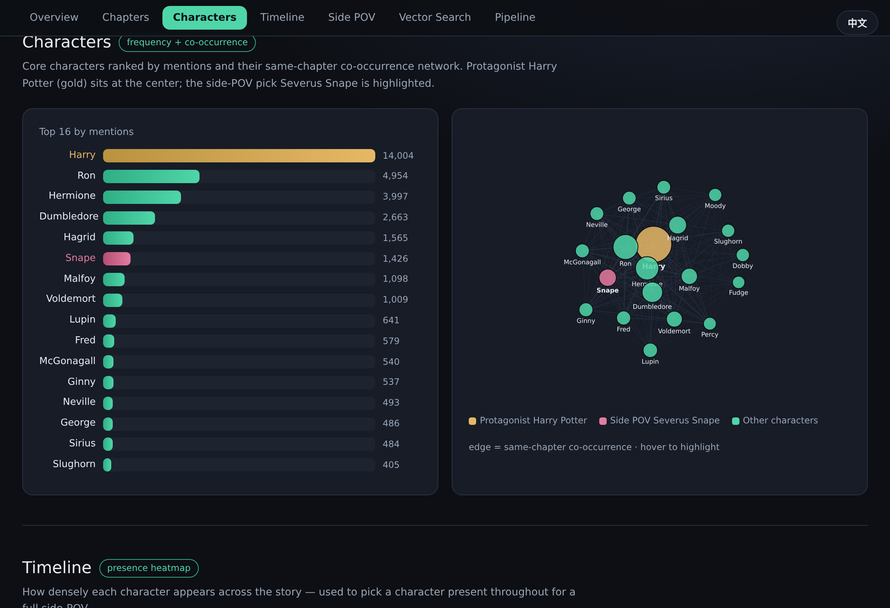
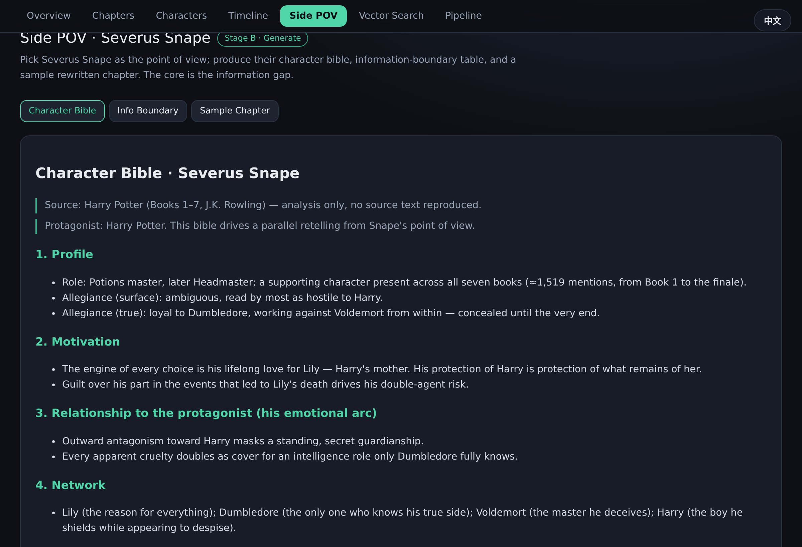

<div align="center">

# NovelRAG · 小说 RAG 引擎

**把一部长篇小说拆解成向量库，再从一个「配角」的视角，续写一部与原著严丝合缝的平行长篇。**

*Deconstruct a full-length novel into a vector store, then rewrite it as a parallel novel from a supporting character's point of view.*

[](LICENSE)
[](web)
[](pipeline)
[](https://youngfreefjs.github.io/novel-rag/)

[English README](README.md) · **中文** · [🌐 在线 Demo](https://youngfreefjs.github.io/novel-rag/)


</div>

---

## 这是什么

`NovelRAG` 是一套「小说拆解 + 配角视角续写」的开源工作流，分两个阶段：

- **阶段 A · 拆解与向量化**：把整本小说清洗、切章切块，抽取人物 / 关系 / 时间线，并 embedding 成可检索的向量库，作为续写时的「**世界真相约束层**」。
- **阶段 B · 配角视角生成**：选定一个配角，产出「**人物圣经**」和「**信息边界表**」，再逐章生成——每章都用向量库回查原著保证不矛盾，同时用信息边界过滤掉配角此刻不该知道的内容。

配角视角小说的灵魂是 **信息差**：读者跟着配角，看到被主角视角遮蔽的另一面。原著早已揭示的真相，配角可能很晚才拼凑出来，甚至一辈子蒙在鼓里。

## 两个 Showcase

可视化内置**双语言、双 showcase**，右上角一键切换。

| 语言 | 源小说 | 主角 | 配角视角 | 信息差看点 |
|---|---|---|---|---|
| 🇨🇳 中文 | 《聚宝仙盆》(2113 章 / 500 万字) | 贺平生 | **乔慧珠** | 她永远不知道主角开挂崛起背后的秘密。 |
| 🇬🇧 英文 | 《Harry Potter》1–7 部 | Harry Potter | **Severus Snape** | 他真实的立场与动机，瞒了整整七部书。 |

<table>
<tr>
<td width="50%"><br><sub>人物排名 + 同章共现网络</sub></td>
<td width="50%"><br><sub>配角人物圣经 &amp; 信息边界表</sub></td>
</tr>
</table>

## 架构

```
源小说(txt)
   │
   ├─[阶段A]─► 清洗 ─► 切章切块 ─► 人物/关系/时间线抽取 ─► 向量库(世界真相层)
   │                                         │
   │                                         └─► 配角人物圣经 + 信息边界表
   │
   └─[阶段B]─► 配角视角大纲 ─► 逐章生成(双路召回) ─► 一致性质检 ─► 配角视角新书
                                    ▲              ▲
                               配角圣经        源小说向量库
```

## 快速开始

**可视化工作台（Next.js）**

```bash
cd web
npm install
npm run dev        # http://localhost:3000
```
七个板块：总览 / 章节结构 / 人物图谱 / 登场时间线 / 配角视角 / 向量检索 / 工作流。图表全部手写 SVG，零第三方图表库；右上角一键切换语言。

**拆解流水线（Python）**

```bash
cd pipeline
pip install -r requirements.txt
# 把源小说放到 ./source/raw.txt（UTF-8），然后：
python 01_clean_split.py    # 清洗 + 切章
python 02_chunk.py          # 两级切块（带重叠）
python 04_char_stats.py     # 词频 / 共现网络 / 时间线
python 05_embed.py          # 向量化（离线 TF-IDF + SVD-256）
python 06_search.py         # 交互式向量检索
python 07_export.py         # 导出可视化数据
```

> 向量化默认用离线的 `TF-IDF + SVD(256 维)`，零外网依赖即可跑通。把 `05_embed.py` 换成 **BGE-M3** 等语义模型可获得更强检索。

## 🌐 在线 Demo（GitHub Pages）

可视化已配置为 **GitHub Pages 静态部署**，别人不装 Node 也能在浏览器里直接看 showcase。

推送到 `main` 后，仓库自带的工作流（`.github/workflows/deploy.yml`）会自动构建并发布。**首次需先手动开启 Pages**：仓库 `Settings → Pages → Source` 选 **GitHub Actions**（默认 token 无法替你创建 Pages 站点）。地址：

```
https://youngfreefjs.github.io/novel-rag/
```
若改了仓库名，把工作流里的 `NEXT_PUBLIC_BASE_PATH: /novel-rag` 同步改成 `/<新仓库名>`。

## 目录

| 目录 | 内容 |
|---|---|
| `web/` | Next.js 14 可视化（App Router，手写 SVG 图表，i18n） |
| `pipeline/` | 拆解脚本 01–07（清洗 → 切块 → 抽取 → 向量化 → 检索 → 导出） |
| `showcase/` | 两个 showcase 的衍生分析 + 配角圣经 / 信息边界 / 视角样章 |
| `docs/` | 设计文档、截图、封面源文件 |

## ⚠️ 版权说明

本仓库只公开**工具代码**与**原创衍生内容**，**不含任何源小说正文全文**，也不含完整的切块 / 向量文件（均已 `.gitignore`）。公开内容仅限于：代码、聚合统计（字数、人物频次、共现网络、时间线）、原创分析（人物圣经、由本工具生成的示范样章，属转化性创作），以及——**仅中文 showcase**——≤220 字的检索片段。英文 showcase **不发布任何原文片段**。请在合法授权范围内使用源文本，版权归原作者所有。

## Roadmap

- [ ] 阶段 B 逐章生成器：分卷大纲 → 章纲 → 正文，接入 LLM
- [ ] 向量后端可插拔（Qdrant / Chroma / BGE-M3）
- [ ] 一致性质检智能体（越界检测 + 自动返工）
- [ ] 多配角一键切换

## 许可

代码以 [MIT 许可证](LICENSE) 发布。showcase 的小说正文**不包含**在内，版权归各自作者所有。
